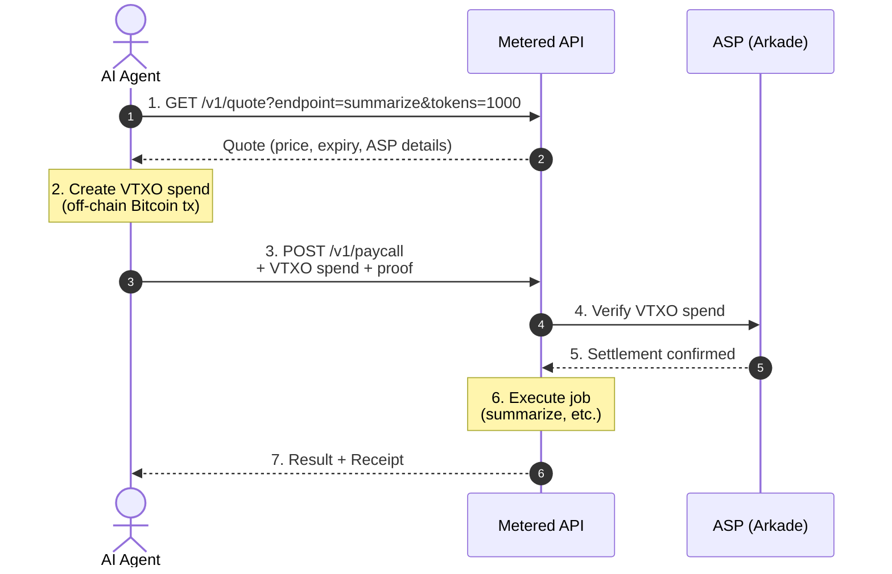
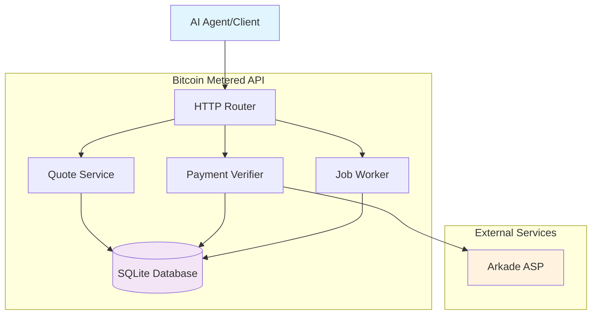
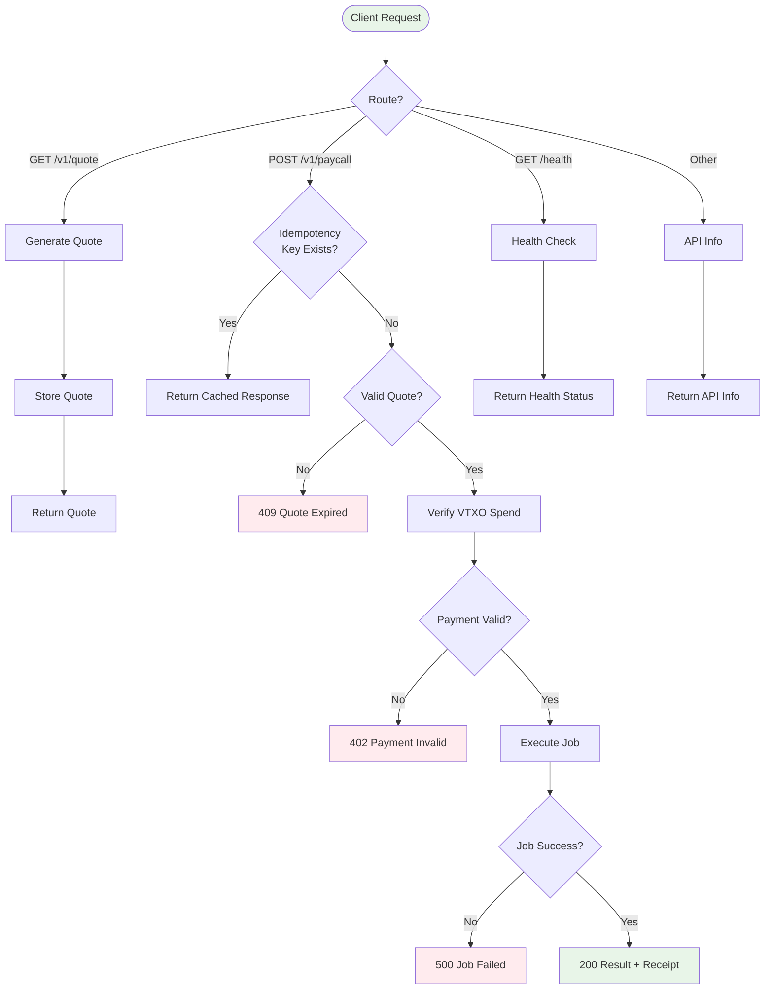
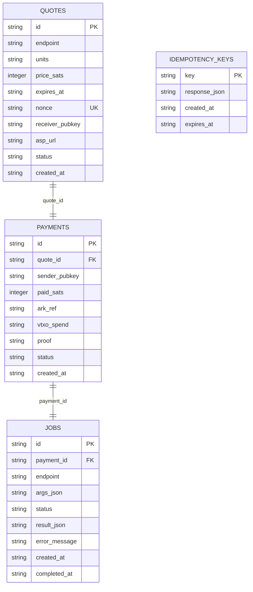

# Bitcoin Metered API

> **Pay-per-request API using Bitcoin L2 (Arkade) — Perfect for AI Agents**

A production-ready proof-of-concept that enables **autonomous AI agents** to pay for API calls **per request** using Bitcoin's Arkade L2 protocol with instant off-chain payments via VTXOs (Virtual Transaction Outputs).

## 🎯 The Use Case

**Problem**: AI agents need to call paid APIs without:
- Creating accounts
- Managing invoices
- Setting up Lightning channels
- Holding large balances with operators
- Trusting wrapped assets

**Solution**: This API lets agents:
1. **Get a quote** for an API call (in satoshis)
2. **Pay instantly** with a Bitcoin VTXO off-chain spend
3. **Receive results** immediately with a cryptographic receipt

**Why this matters**:
- ⚡ **Instant payments**: Off-chain settlement, no block confirmations
- 🤖 **Agent-friendly**: No accounts, no sessions, pure pay-per-call
- 💰 **Micro-payments**: Pay fractions of a cent per API call
- 🔒 **Bitcoin-native**: Real BTC on Arkade L2, no tokens or wrapping
- 🚪 **Unilateral exit**: Can always exit on-chain if ASP goes down

## 🚀 Quick Start

### Installation

```bash
git clone https://github.com/your-username/bitcoin-metered-api
cd bitcoin-metered-api
npm install
```

### Run Locally (Free Mode)

```bash
# Copy environment config
cp .env.example .env

# Start the server (payments bypassed in free mode)
npm run dev
```

The API will be available at `http://localhost:3000`

### Test the Flow

```bash
# 1. Get a quote
curl "http://localhost:3000/v1/quote?endpoint=summarize&tokens=1000"

# Response:
# {
#   "endpoint": "summarize",
#   "units": { "tokens": 1000 },
#   "price_sats": 50,
#   "expires_at": "2025-10-24T00:37:40Z",
#   "quote_id": "q_abc123...",
#   "ark": {
#     "asp_url": "https://asp.testnet.arkade.example",
#     "receiver_pubkey": "ark1q...",
#     "round_hint": "r_2025-10-24T00:37:10Z"
#   }
# }

# 2. Pay and call (in free mode, any payment data works)
curl -X POST http://localhost:3000/v1/paycall \
  -H "Content-Type: application/json" \
  -d '{
    "quote_id": "q_abc123...",
    "ark_payment": {
      "vtxo_spend": "base64encodedspend",
      "proof": "base64encodedproof",
      "sender_pubkey": "ark1q..."
    },
    "request": {
      "endpoint": "summarize",
      "args": {
        "text": "Bitcoin is a decentralized digital currency..."
      }
    }
  }'

# Response:
# {
#   "status": "ok",
#   "result": {
#     "summary": "Bitcoin is a decentralized digital currency...",
#     "original_length": 150,
#     "tokens_processed": 25
#   },
#   "receipt": {
#     "settlement_ref": "ark:round:r_2025.../tx:abc123",
#     "paid_sats": 50,
#     "job_id": "job_xyz789",
#     "payment_id": "pay_def456"
#   }
# }
```

## 📖 How It Works

### Agent Flow



### Payment Verification

In **free mode** (development):
- All payments automatically succeed
- No actual Bitcoin required
- Perfect for testing and iteration

In **testnet/mainnet mode**:
- VTXO spend verified with Arkade ASP
- Cryptographic proof checked
- Double-spend prevention
- Settlement reference returned

## 🎛️ Available Endpoints

### 1. Summarize Text
```bash
# Quote
GET /v1/quote?endpoint=summarize&tokens=1000

# Pricing: 5 sats per 100 tokens
```

### 2. Generate Image (Mock)
```bash
# Quote
GET /v1/quote?endpoint=generate_image&images=1

# Pricing: 50 sats per image
```

### 3. Translate Text (Mock)
```bash
# Quote
GET /v1/quote?endpoint=translate&characters=500

# Pricing: 3 sats per 100 characters
```

### 4. Generic Compute
```bash
# Quote
GET /v1/quote?endpoint=compute&seconds=5

# Pricing: 10 sats per second
```

## 🔧 Configuration

### Environment Variables

```bash
# Server
PORT=3000
NODE_ENV=development

# Payment Mode
PAYMENTS_MODE=free          # Options: free, testnet, mainnet

# Arkade Configuration (for testnet/mainnet)
ARK_ASP_URL=https://asp.testnet.arkade.example
ARK_RECEIVER_PUBKEY=ark1q...

# Database
DATABASE_PATH=./data/metered-api.db

# Logging
LOG_LEVEL=info              # Options: debug, info, warn, error
```

## 📚 Documentation

- **[API Reference](./docs/API.md)** - Complete API documentation
- **[Usage Guide](./docs/USAGE.md)** - Step-by-step examples
- **[Deployment](./docs/DEPLOYMENT.md)** - Production deployment guide
- **[Runbook](./docs/RUNBOOK.md)** - Operations and troubleshooting

## 🧪 Testing

```bash
# Run all tests
npm test

# Unit tests only
npm run test:unit

# Integration tests only
npm run test:integration

# Type checking
npm run typecheck

# Linting
npm run lint
```

## 🏗️ Architecture

### System Components



### Request Lifecycle



### Database Schema



### File Structure

```
src/
├── config.ts              # Configuration loading
├── server.ts              # Main application entry
├── db/
│   └── database.ts        # SQLite schema and queries
├── ark/
│   ├── aspClient.ts       # ASP communication
│   └── verify.ts          # Payment verification
├── payments/
│   └── quotes.ts          # Quote generation and pricing
├── worker/
│   └── jobs.ts            # Job execution (API work)
└── api/
    └── handlers.ts        # HTTP route handlers
```

## 🌐 Production Deployment

### With Real Arkade Payments

1. **Set up Arkade ASP connection**
   ```bash
   PAYMENTS_MODE=testnet
   ARK_ASP_URL=https://asp.testnet.arkade.example
   ARK_RECEIVER_PUBKEY=your_ark_pubkey
   ```

2. **Fund your Arkade wallet** with testnet BTC

3. **Deploy and monitor**
   ```bash
   npm run build
   npm start
   ```

### Docker Deployment

```bash
# Build
docker build -t bitcoin-metered-api .

# Run
docker run -p 3000:3000 \
  -e PAYMENTS_MODE=free \
  -e DATABASE_PATH=/data/db.sqlite \
  -v $(pwd)/data:/data \
  bitcoin-metered-api
```

## 🔐 Security Considerations

- **Idempotency**: All paycall requests support `Idempotency-Key` header to prevent double-charging on retries
- **Quote expiration**: Quotes expire after 30 seconds to prevent price manipulation
- **Anti-replay**: Nonce-based replay protection for all quotes
- **Payment verification**: All payments verified before job execution
- **Audit trail**: Complete payment and job history stored with settlement references

## 🤝 Contributing

Contributions welcome! This is a proof-of-concept showing the pattern for Bitcoin-metered APIs.

### Adding New Endpoints

1. Add pricing rule in `src/payments/quotes.ts`
2. Add worker implementation in `src/worker/jobs.ts`
3. Write tests in `__tests__/`
4. Update documentation

## 📜 License

MIT

## 🙏 Acknowledgments

- Built on [Arkade](https://arkade.example) - Bitcoin L2 using Ark protocol
- Inspired by the need for autonomous agent economies
- Part of the Bitcoin micro-payment ecosystem

---

**Ready to build the agent economy?** Start here. 🚀
